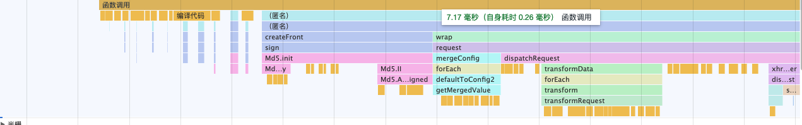
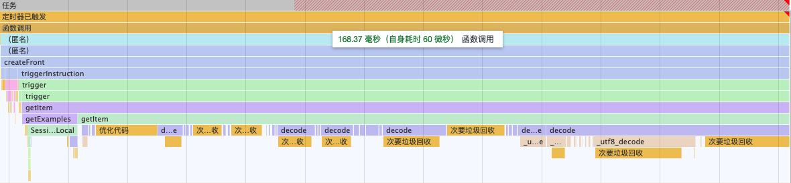

# 介绍
instruct request axis 是基于 axios 的指令请求器，用来实现逻辑分离
 
通过注册指令插件，来完成针对功能的分离
 
例如我们常用的 `token注册` `页码参数传递` `权限校验` `数据模版替换` `多模式请求` `等等..`
 
都可以通过自定义指令来完成逻辑抽离

### 为什么叫指令
主要逻辑参考vue中的指令，通过生命周期和绑定请求对象来进行自定义操作流程，以此来实现公共逻辑的分离，让流程变得简单清晰些，并且根据指令可以快速的分辨出此功能的应用，减少维护的复杂性

### 主要实现了什么？
主要实现了一个指令收容分配机制，通过给定的指令配置进行分发

### 性能问题
::: warning
目前初始版本采用的一些实现方式，性能并不佳，如果对执行性能要求极高的，不建议使用
:::
性能方面众所周知肯定用到的插件越多，耗时就越多 目前测试性能结果如图
 
 

 
 
纯净执行的情况下需要7毫秒左右,插件本身目前耗时主要来源于 md5 加密生成sign令牌，这是请求的身份证件，查找指令执行生命周期，发起请求
 
可能你这感觉还没有什么，那么再看部分插件的耗时，你可能会惊讶
 
 

 
 
会不会感到惊讶的发现多出了160ms，此因为使用插件cache 缓存，而 cache内部采用的(ASE)加密解密，导致首次执行需要同步一些东西，并且获取数据仍然进行解密，数据量越大解密工作就需要更久，并且加上获取本地缓存的时间，出现这种性能情况，优化方面做的还是不足的，后续的请求虽然会加快，因为会在内存做了一份数据备份，优先走内存查找，但初始的加载耗时也不得不注意，这就是我想告诉大家的，虽然执行请求，会被放置最后执行，且增加的部分性能负担，察觉不出，但为了您的程序，还是建议提高警惕!!!